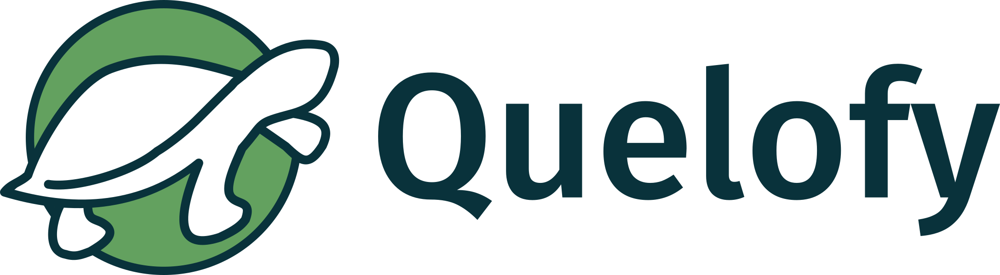

[](https://svgshare.com/i/ZhY.svg) [](https://GitHub.com/Naereen/StrapDown.js/releases/)

<h1 align ="center" >Preservação de Quelônios - Quelofy🐢</h1>

<p align ="center"></p>


## 🔖  Sobre

O projeto Preservação de Quelônios é uma aplicação de Gerenciamento de Dados que está sendo desenvolvida dentro do curso Full-Stack Java/Angular, no contexto do programa Transforme-se - Serasa Experian. O intuito é colocar em prática todo o conteúdo estudado, e auxiliar o Projeto Pé-de-Pincha através da tecnologia. O projeto Pé-de-Pincha é um programa de extensão da Universidade Federal do Amazonas que promove a pesquisa, a conservação e o manejo sustentável de quelônios em comunidades ribeirinhas da região amazônica.
O desenvolvimento das funcionalidades foi construído de acordo com a necessidade melhorar  a coleta de dados, feita pelos voluntários do Projeto Pé-De-Pincha durante o período de realização das viagens, nas comunidades participantes.


Projeto Integrador - Squad Amazonas - Digital House Brasil - Programação Full Stack (Java e Angular) - Transforme-se Serasa Experian

## 💻 Funcionalidades
**Inserção de ciclos** - cadastrar o ciclo que contemplará as três viagens realizadas durante o tempo de execução do projeto,  referente a cada etapa exercida, coleta, eclosão e soltura.

**Inserção de viagens** - cadastrar cada viagem, de acordo com o calendário de programação do projeto e de acordo com a etapa a ser realizada.

**Preenchimento de formulários** - adicionar as informações relevantes que cada etapa do projeto necessita para fazer o controle das fases de coleta, eclosão e soltura. 

**Inserção de usuários** - cadastrar as pessoas voluntárias do projeto, para que tenham acesso ao sistema de preenchimento dos formulários.

**Geração de relatórios** - gerar relatórios em pdf, com os dados de cada fase do projeto, facilitando assim, a manipulação individual das informações relevantes de cada etapa.

## 📊 Diagrama de classe
<p align ="center"></p>

## 📋 Pré-requisitos
Para executar o projeto, será necessário instalar os seguintes programas:
**JDK 11**
**Spring Boot**
**Angular**
**Eclipse**
**VS Code**
**MySQL**

## 🔧 Começando

Para execução do projeto na máquina local, clone o repositório da API e também o repositório do front-end, que se encontra [aqui]( https://github.com/NaaraMarinheiro/Preservacao-de-Quelonios-front), em um repositório de sua preferência.

Para clonar este repositório:

* cd "repositorio de sua preferencia"
* git clone https://github.com/YacciRocha/Preservacao-de-Quelonios.git

Para clonar o repositório do frontend:

* cd "repositorio de sua preferencia"
* git clone https://github.com/NaaraMarinheiro/Preservacao-de-Quelonios-front.git


## 🛠️ Construção

Siga as instruções:

* Abra o código da API na sua IDE de preferência.

*Para que o projeto rode com sucesso, é necessário rodar o comando clean e install do maven, devido o uso da lib do mapstruct para o mapeamento. 
 
```
mvn clean install
```

 *O comando irá baixar todas as dependências do projeto e criar um diretório target com os artefatos construídos, que incluem o arquivo jar do projeto. Além disso, serão executados os testes unitários, e se algum falhar, o Maven exibirá essa informação no console.*

 *Em seguida já é possível rodar a aplicação spring, através do comando: 
 
 ```
 Run As: Spring Boot App.
 ```

*Com a API de pé, já é possível fazer testes de funcionamento via postman. 

*Para ter acesso ao sistema completo, é necessário também subir a aplicação do Angular, para isso, siga as seguintes instruções:*

*Abra o código angular em sua IDE de preferência.

*No console do node, rode o comando npm install, para gerar o arquivo de node_modules e assim, o aplicativo funcionar corretamente.
```
npm install
```
 *Em seguida, rode o comando ng serve, o sistema rodará na porta 4200.
```
ng serve
```
 
*Para ter acesso, abra o caminho localhost:4200 no browser. 


## 🚀 Tecnologias utilizadas

O projeto foi desenvolvido utilizando as seguintes tecnologias:

* **Java** - Desenvolvimento do back-end (versão 11)
* **Spring** - Desenvolvimento do back-end (versão 2.7.0)
* **Mapstruct** - Mapeamento do back-end (versão 1.5)
* **Lombok** - Lib de Java (versão 1.18)
* **JasperReports** - Api externa - geração de pdf (versão 6.19.1)
* **MySQL**- Banco de dados (versão 8.0)

* **Typescript** - Desenvolvimento do front-end
* **Angular**  - Desenvolvimento do front-end (versão 14)
* **HTML5** - Desenvolvimento do front-end
* **CSS3** - Desenvolvimento do front-end
* **Bootstrap** - Framework do front-end ( versão 5)
* **Axios** - Cliente http baseado em promessas (versão 0.27)
* **Chart.js** - Lib de gráficos (versão 3.8)
* **Toastr-ngx** - Exibição de notificações (versão 15)
* **Figma** - Editor de prototipagem

## ✒️ Autoras
* **Naara Marinheiro** - [Git Hub - ](https://github.com/NaaraMarinheiro)  | [Linkedin - ](https://www.linkedin.com/in/naaramarinheiro/)
* **Pamela Guerra** - [Git Hub -](https://github.com/Pam-Guerra)  |  [Linkedin - ]()
* **Viviane Mayumi** - [Git Hub -](https://github.com/VivianeMayumi) |  [Linkedin - ]()
* **Yacci Rocha** -  [Git Hub -](https://github.com/YacciRocha) |  [Linkedin - ]()
